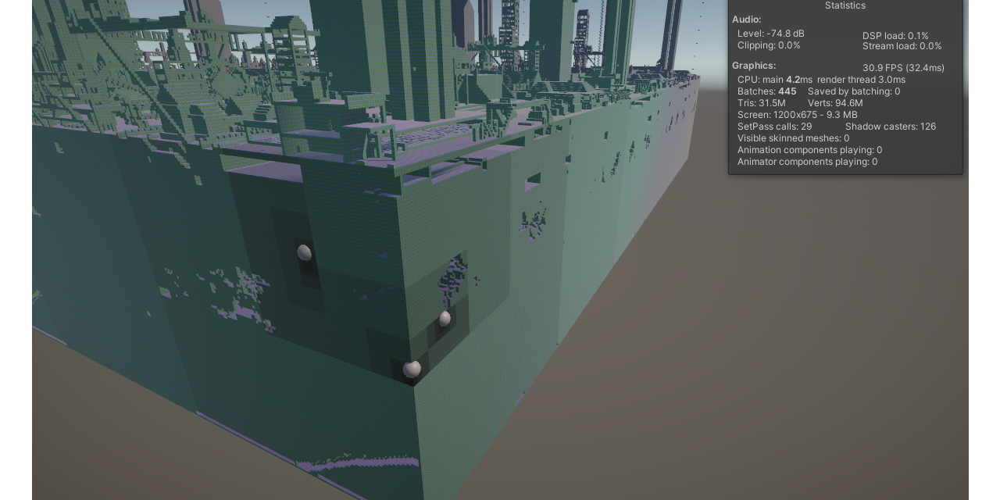

# Simple Mesh Subdivision Sample

Welcome to the Simple Mesh Subdivision Sample repository!  
This repository is a sample for mesh subdivision around each coordinate of interest input.   
Its technical excellence lies in its ability to perform mesh subdivision quickly without imposing a load on the main thread.  



## Getting Started
Follow these steps to try out the Sample:

1. Clone this repository.
1. Open the project from the cloned folder using Unity Hub.
1. Play the sample scene.
1. Pressing the space key.

# ランタイム メッシュワールドサンプル

**ランタイムメッシュ細分化サンプル** リポジトリへようこそ！  
このリポジトリは興味をもつ座標群を入力に、各座標周辺をメッシュ細分化するサンプルです。  
メインスレッドに負荷をかけることなく、それでいて素早くメッシュ細分化ができる所が技術的に優れたポイントです。    

## 始め方

以下の手順に従って、サンプルをお試しできます。

1. このリポジトリをクローンします。
1. Unity Hub 経由でクローンしたフォルダからプロジェクトを開きます。
1. サンプルシーンを開いて再生します。
1. スペースキーを押します。

## How to use

```csharp
using System.Collections.Generic;
using System.IO;
using System.Threading.Tasks;
using Unity.Collections;
using Unity.Jobs;
using Unity.Mathematics;
using UnityEngine;
using UnityEngine.Rendering;
using static SimplestarGame.CAWFile;

namespace SimplestarGame
{
    public class IndexXYZ
    {
        public NativeArray<XYZ> xyz;
        public NativeArray<int> countOffsets;
    }

    public class SimpleMeshSubdivisionSample : MonoBehaviour
    {
        [SerializeField] string meshFileName = "BasicCube.caw";
        [SerializeField] string dataFileName = "world000.gz";

        [SerializeField] Material material;
        [SerializeField] Transform[] parents;
        [SerializeField] Transform[] interactPoints;
        [SerializeField] Color[] levelColors = new Color[] {
            Color.white * 0.2f,
            Color.white * 0.3f,
            Color.white * 0.4f,
            Color.white * 0.5f,
            Color.white * 0.6f,
            Color.white * 0.7f,
            Color.white * 0.8f,
            Color.white * 0.9f,
            Color.white * 0.95f,
            Color.white };

        /// <summary>
        /// ワールドを構成する最大粒度チャンク
        /// </summary>
        List<SimpleMeshChunk> chunks = new List<SimpleMeshChunk>();
        SimpleMeshChunkBuilder chunkBuilder;

        CubeData cubeData;
        NativeArray<byte> voxelData;
        List<IndexXYZ> levelDataList;

        Task createMeshesTask = null;
        bool cancelCreateMeshes = false;

        float timer = 0f;
        float interval = 10f; // 処理を実行する間隔（秒）

        void Awake()
        {
            Application.targetFrameRate = 30;
            GraphicsSettings.useScriptableRenderPipelineBatching = true;
        }

        async void Start()
        {
            // キューブのメッシュデータソースを読み込み
            this.cubeData = await Task.Run(() => CAWFile.ReadCAWFile(Path.Combine(Application.streamingAssetsPath, this.meshFileName)));
            // ワールドのボクセルデータ読み込み
            var compressedData = await Task.Run(() => File.ReadAllBytes(Path.Combine(Application.streamingAssetsPath, this.dataFileName)));
            // ワールドのデータ解凍
            var worldDataBytes = await Task.Run(() => GZipCompressor.Unzip(compressedData));
            this.voxelData = await Task.Run(() => new NativeArray<byte>(worldDataBytes, Allocator.Persistent));
            // Job用NativeArray確保
            this.levelDataList = await AllocateDataAsync();
            // ビルダーを初期化
            this.chunkBuilder = new SimpleMeshChunkBuilder(this.cubeData, this.voxelData, this.levelDataList, this.material, this.levelColors);

            // チャンクオブジェクトを作成、リスト化
            this.chunks.Clear();
            foreach (var parent in this.parents)
            {
                var myChunkLevel = ChunkLevel.Cube256;
                var edgeCubes = SimpleMeshChunk.levelEdgeCubes[(int)myChunkLevel];
                for (int chunkX = 0; chunkX < 1; chunkX++)
                {
                    for (int chunkY = 0; chunkY < 1; chunkY++)
                    {
                        for (int chunkZ = 0; chunkZ < 1; chunkZ++)
                        {
                            var chunkOffset = new Vector3Int(chunkX, chunkY, chunkZ) * edgeCubes;
                            var newGameObject = new GameObject($"{chunkX}, {chunkY}, {chunkZ}");
                            newGameObject.transform.SetParent(parent.transform, false);
                            newGameObject.transform.localPosition = chunkOffset;
                            newGameObject.isStatic = true;
                            var chunk = newGameObject.AddComponent<SimpleMeshChunk>();
                            chunk.SetData(myChunkLevel, chunkOffset);
                            this.chunks.Add(chunk);
                        }
                    }
                }
            }
            Vector3[] interactPoints = new Vector3[this.interactPoints.Length];
            for (int i = 0; i < this.interactPoints.Length; i++)
            {
                interactPoints[i] = this.interactPoints[i].position;
            }
            this.createMeshesTask = this.CreateWorldMeshes(this.chunks, interactPoints);
        }

        void OnDestroy()
        {
            // 確保したものを開放
            foreach (var levelData in this.levelDataList)
            {
                levelData.countOffsets.Dispose();
                levelData.xyz.Dispose();
            }
            this.voxelData.Dispose();
            this.cubeData.fileVertexData.Dispose();
            this.cubeData.vertexCounts.Dispose();
        }

        async void Update()
        {
            // タイマーを更新
            this.timer += Time.deltaTime;

            // タイマーが指定した間隔を超えた場合に処理を実行
            if (this.timer >= this.interval)
            {
                await this.ReBuildMesh();

                // タイマーをリセット
                this.timer = 0f;
            }

            // Space キーを押すと、興味ポイント付近のメッシュを再構築
            if (Input.GetKeyDown(KeyCode.Space))
            {
                await this.ReBuildMesh();
            }
        }

        async Task ReBuildMesh()
        {
            while (this.createMeshesTask != null && !this.createMeshesTask.IsCompleted)
            {
                this.cancelCreateMeshes = true;
                await Task.Delay(100);
            }
            Vector3[] interactPoints = new Vector3[this.interactPoints.Length];
            for (int i = 0; i < this.interactPoints.Length; i++)
            {
                interactPoints[i] = this.interactPoints[i].position;
            }
            this.createMeshesTask = this.CreateWorldMeshes(this.chunks, interactPoints);
        }

        /// <summary>
        /// チャンクを順番にメッシュオブジェクト化
        /// </summary>
        /// <param name="chunks">ソートされたチャンク一覧</param>
        /// <param name="interactPoints">興味ポイント座標一覧</param>
        /// <returns>async Task</returns>
        async Task CreateWorldMeshes(List<SimpleMeshChunk> chunks, Vector3[] interactPoints)
        {
            this.cancelCreateMeshes = false;
            // 現在のチャンク一覧をカメラに近い順にソート
            var mainCamera = Camera.main.transform;
            await this.SortChunksAsync(chunks, mainCamera.position, mainCamera.forward);
            List<GameObject> meshObjectList = new List<GameObject>();
            foreach (var chunk in chunks)
            {
                if (this.cancelCreateMeshes)
                {
                    break;
                }
                if (chunk.dot < 0f && 256 < chunk.distance)
                {
                    // 表示不要なものはスキップ
                    continue;
                }
                await this.chunkBuilder.CreateChunkMesh(meshObjectList, chunk, interactPoints, true);
            }
        }

        async Task SortChunksAsync(List<SimpleMeshChunk> chunks, Vector3 viewPoint, Vector3 viewDirection)
        {
            await Task.Run(() => { SortChunks(chunks, viewPoint, viewDirection); });
        }

        static void SortChunks(List<SimpleMeshChunk> chunks, Vector3 viewPoint, Vector3 viewDirection)
        {
            var points = new NativeArray<float3>(chunks.Count, Allocator.Persistent);
            var cameraDistances = new NativeArray<DotDistance>(chunks.Count, Allocator.Persistent);
            for (int i = 0; i < chunks.Count; i++)
            {
                var chunk = chunks[i];
                points[i] = chunk.center;
            }
            var calculateCameraDistanceJob = new CalculateDotDistanceJob()
            {
                points = points,
                viewPoint = viewPoint,
                viewDirection = viewDirection,
                dotDistances = cameraDistances
            };
            calculateCameraDistanceJob.Schedule(points.Length, 1).Complete();
            for (int i = 0; i < cameraDistances.Length; i++)
            {
                var cameraDistance = cameraDistances[i];
                chunks[i].distance = cameraDistance.distance;
                chunks[i].dot = cameraDistance.dot;
            }
            cameraDistances.Dispose();
            points.Dispose();
            chunks.Sort((a, b) => a.distance > b.distance ? 1 : -1);
        }

        /// <summary>
        /// 計算で毎回使うバッファ、使いまわすために最初に確保
        /// </summary>
        /// <returns>確保したバッファ</returns>
        static async Task<List<IndexXYZ>> AllocateDataAsync()
        {
            return await Task.Run(() => {
                List<IndexXYZ> levelDataList = new List<IndexXYZ>();
                for (ChunkLevel chunkLevel = ChunkLevel.Cube1; chunkLevel <= ChunkLevel.Cube256; chunkLevel++)
                {
                    var edgeCubeCount = SimpleMeshChunk.levelEdgeCubes[(int)chunkLevel];
                    var size = edgeCubeCount * edgeCubeCount * edgeCubeCount;
                    var xyz = new NativeArray<XYZ>(size, Allocator.Persistent);
                    var countOffsets = new NativeArray<int>(size, Allocator.Persistent);
                    for (int x = 0; x < edgeCubeCount; x++)
                    {
                        for (int y = 0; y < edgeCubeCount; y++)
                        {
                            for (int z = 0; z < edgeCubeCount; z++)
                            {
                                var index = x * edgeCubeCount * edgeCubeCount + y * edgeCubeCount + z;
                                xyz[index] = new XYZ { x = (byte)x, y = (byte)y, z = (byte)z };
                                countOffsets[index] = 0;
                            }
                        }
                    }
                    levelDataList.Add(new IndexXYZ { xyz = xyz, countOffsets = countOffsets });
                }
                return levelDataList;
            });
        }
    }
}
```

## License
This project is licensed under the MIT License.

## Contribution
If you find a bug, have an enhancement idea, or want to contribute in any other way, please open an issue or submit a pull request.
